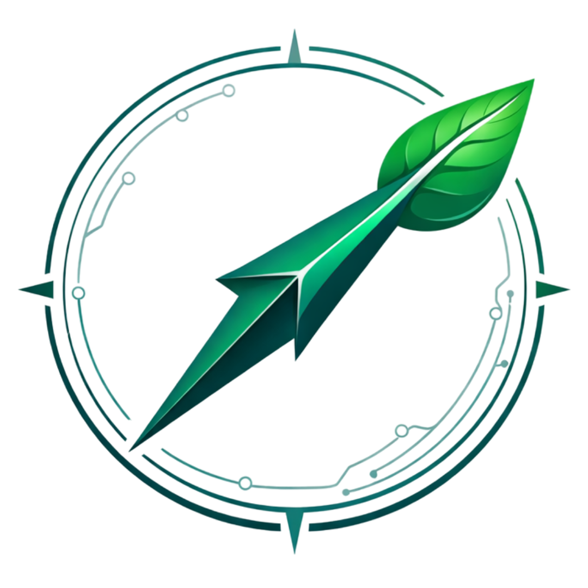
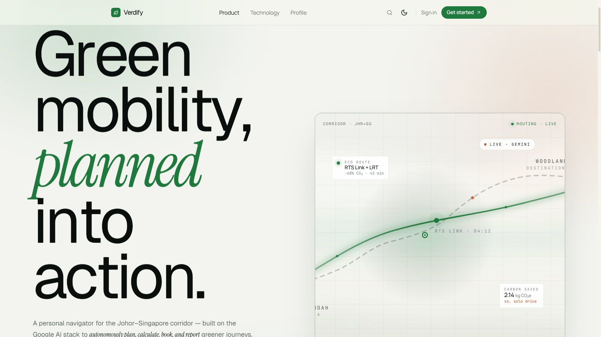
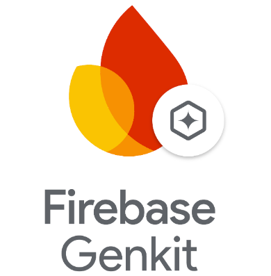
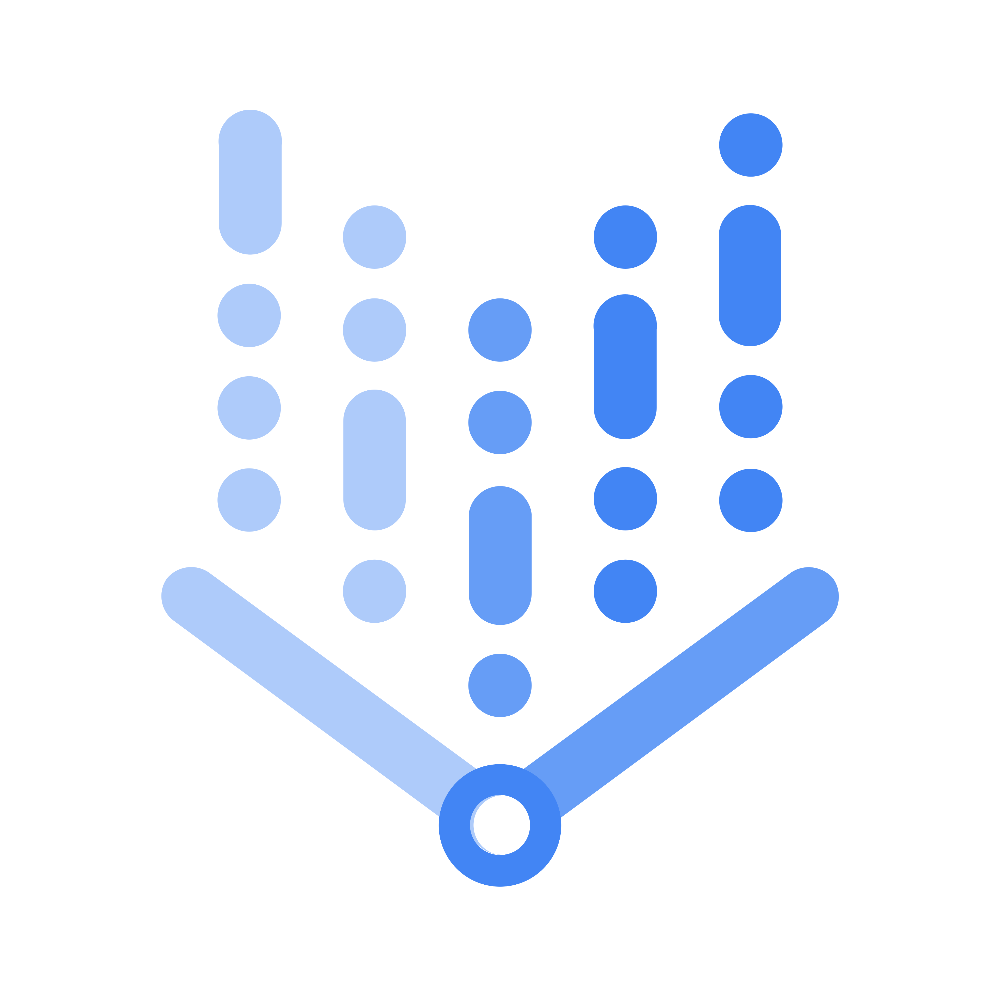
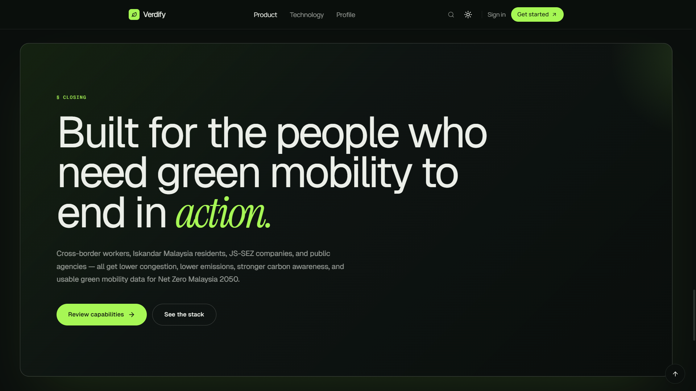
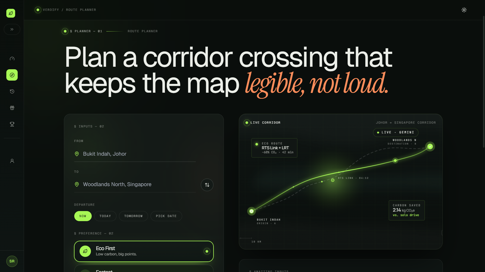
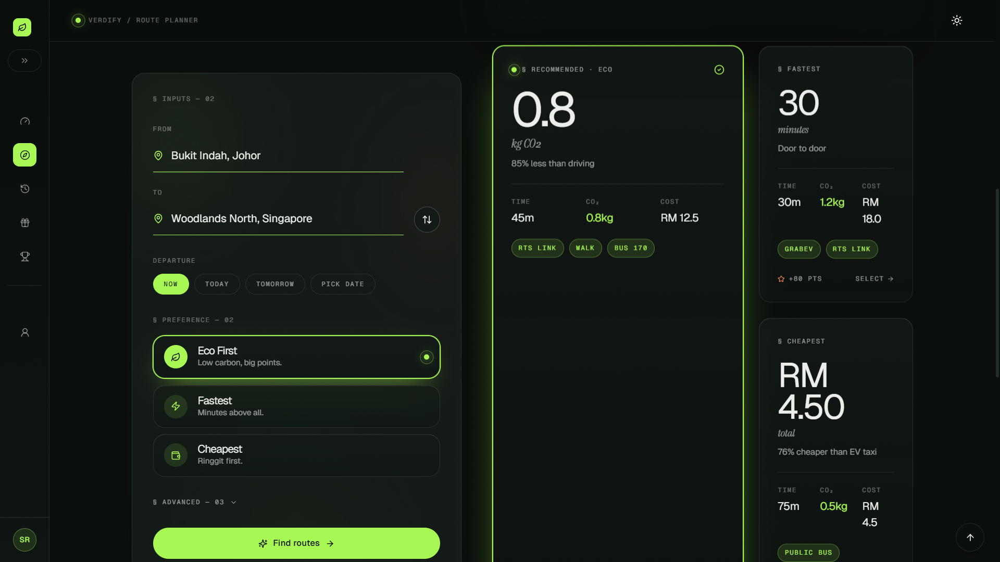
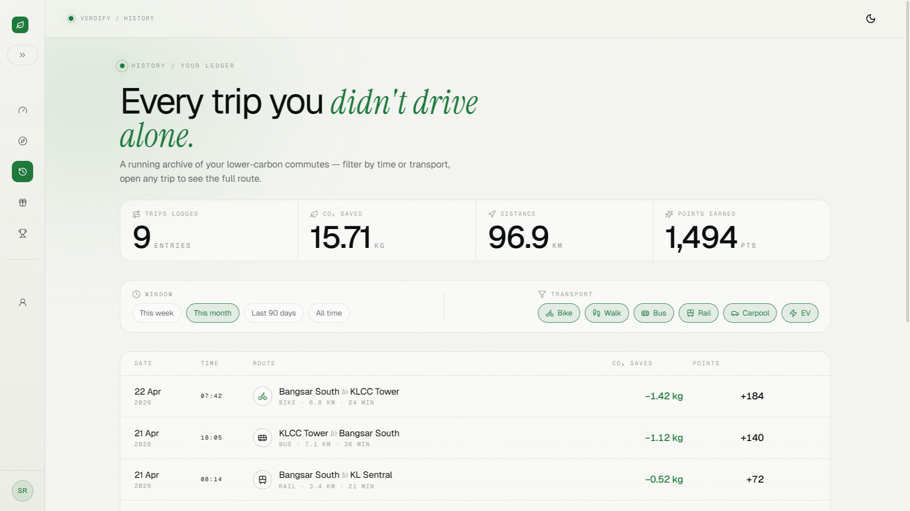
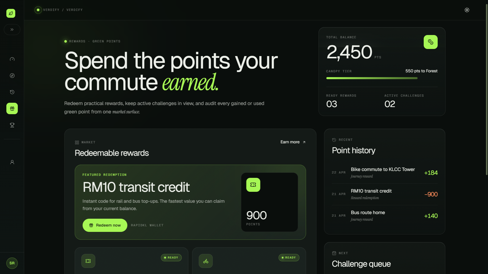
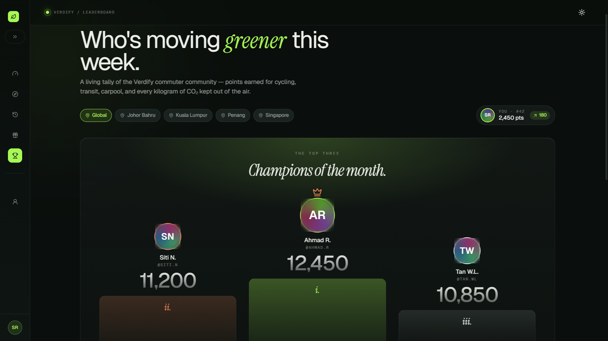

<div align="center"> 
    <div>
        
    </div>
    <div>
            <h3><b>Verdify</b></h3>
            <p><i>Your Personal AI Green Navigator for the Johor-Singapore Innovation Corridor</i></p>
    </div>
</div>
<br>

<h1 align="center">MyAI Future Hackathon 2026
<br/>
Project 2030: Advancing the Nation by Building Solutions with Google AI
</h1>
<div align="center">



</div>
<br>

**Verdify** is an AI Personal Green Navigator specifically designed to address mobility and carbon emissions issues in the Johor-Singapore Innovation Corridor (JS-SEZ). By leveraging the **Google AI Ecosystem Stack** (Gemini, Firebase Genkit, Vertex AI Search RAG, and Google Cloud Run), Verdify not only provides route recommendations but also autonomously plans, calculates, books, and reports on users' green journeys.

Built as a strategic response to Malaysia's RM20+ billion annual congestion losses, Verdify transforms daily commuters into active contributors toward **Malaysia's Net Zero 2050** target. The platform serves three primary stakeholders: individual commuters (B2C), enterprises with fleet operations (B2B), and government agencies monitoring national mobility (B2G).

**Pitch Deck:** [verdify-pitch-deck](https://drive.google.com/file/d/1n6uWS8UHH8Oyjjla3y6tCHtZRm2BmtOj/view?usp=sharing)

**Video Demo:** [verdify-video-demo](https://drive.google.com/file/d/1zzDwlLQInqVw1m-_0cPcS6SAeKJpfWAK/view?usp=sharing)

---

## ⚙️ Technology Stack: Frontend

<div align="center">

<kbd></kbd>
<kbd></kbd>
<kbd></kbd>
<kbd></kbd>
<kbd></kbd>

</div>

<div align="center">
<h4>React | Vite | TypeScript | TailwindCSS | ShadcnUI | Framer Motion | Recharts | Lucide React</h4>
</div>

---

## 🧠 Google AI Ecosystem Stack

<div align="center">

<kbd></kbd>
<kbd></kbd>
<kbd></kbd>
<kbd></kbd>

</div>

<div align="center">
<h4>Gemini 2.0 Flash/Pro | Firebase Genkit | Vertex AI Search | Google Cloud Run</h4>
</div>

---

## 🎯 Problem Statement

Three interconnected barriers prevent daily commuters in the Johor-Singapore corridor from adopting sustainable mobility:

| Problem | Impact |
| :--- | :--- |
| **Severe Mobility Congestion** | 300,000+ daily crossings on Causeway; 2-3 hours travel time (should be 30 min); RM20+ billion annual economic loss |
| **Rising Carbon Emissions** | Transport sector contributes 27% of national emissions; INCREASING 3% annually; Net Zero 2050 target at risk |
| **Energy Crunch (April 2026)** | Diesel price up 40%; transport costs up 25-30%; no incentive for green alternatives |

**Key Insight:** 78% of commuters KNOW public transport is greener, but only 23% actually USE it. Existing solutions (Google Maps, Grab, Moovit) provide INFORMATION but not INCENTIVES, ACTION, or TRUST.

---

## 💡 Our Solution

Verdify serves as an end-to-end **B2C, B2B, and B2G** technological bridge between AI-powered route intelligence and real-world green mobility action:

### 1️⃣ B2C Web App (Individual Commuters)
- Smart Eco Routing with multi-modal options (RTS, LRT, bus, walking, biking, EV)
- Real-Time Carbon Intelligence with live traffic, weather, and occupancy data
- Green Points & Reward System (redeem for toll discounts, coffee, EV credits)
- Peak Hour Load Balancing with 2x points for off-peak travel
- Reimbursement System (compensated if ETA is wrong)

### 2️⃣ B2B Enterprise Dashboard (Fleet Managers, Corporations)
- Fleet emission tracking & ESG reporting
- Employee commuting carbon analytics
- Bulk reward distribution & corporate challenges
- API access for internal systems

### 3️⃣ B2G Government Dashboard (MyDIGITAL, MOT, JS-SEZ)
- Real-time mobility heatmap & congestion monitoring
- Carbon emission tracking by region
- Policy impact simulation & commuter behavior analytics
- Data sovereignty & national agenda alignment

---

## 🔄 End-to-End Workflow

```
┌─────────────────────────────────────────────────────────────────────────────┐
│                         USER INPUT LAYER                                     │
│        Origin | Destination | Departure Time | Preference (Eco/Fast/Cheap) │
└─────────────────────────────────────────────────────────────────────────────┘
                                      │
                                      ▼
┌─────────────────────────────────────────────────────────────────────────────┐
│                      AGENTIC AI CORE (Genkit + Gemini)                       │
│         Multi-step reasoning | RAG retrieval | Tool calling | Execution     │
└─────────────────────────────────────────────────────────────────────────────┘
                                      │
          ┌───────────────────────────┼───────────────────────────┐
          ▼                           ▼                           ▼
┌───────────────┐          ┌───────────────┐          ┌───────────────┐
│  B2C Web App  │          │ B2B Dashboard │          │ B2G Dashboard │
│  (Commuter)   │          │ (Enterprise)  │          │ (Government)  │
├───────────────┤          ├───────────────┤          ├───────────────┤
│• Plan Route   │          │• Fleet Track  │          │• Mobility Map │
│• View Options │          │• ESG Report   │          │• Carbon Track │
│• Book & Pay   │          │• Corp Rewards │          │• Policy Tools │
│• Earn Points  │          │• API Access   │          │• Heatmaps     │
│• Verify Trip  │          │               │          │               │
└───────────────┘          └───────────────┘          └───────────────┘
                                      │
                                      ▼
┌─────────────────────────────────────────────────────────────────────────────┐
│                      SETTLEMENT LAYER (Booking & Payment)                    │
│              Ticket Booking | QR Generation | Points Distribution           │
└─────────────────────────────────────────────────────────────────────────────┘
                                      │
                                      ▼
┌─────────────────────────────────────────────────────────────────────────────┐
│                         VERDIFY USER WALLET                                  │
│              (Green Points | Booking History | Carbon Impact)               │
└─────────────────────────────────────────────────────────────────────────────┘
```

---

## 🧩 Core Features

### 🌿 Features for Commuters (B2C)

- **Smart Eco Routing** – Multi-modal routes optimized for lowest carbon, not fastest time. 85% less CO₂ compared to driving alone.
- **Real-Time Carbon Intelligence** – Live traffic, weather, and occupancy data for accurate emissions calculation.
- **Green Points & Rewards** – Earn points for every green journey. Redeem for toll discounts, coffee vouchers, EV credits, or planting trees.
- **Peak Hour Load Balancing** – 2x points for off-peak travel to actually reduce congestion, not just avoid it.
- **Reimbursement System** – If route takes longer than predicted, get compensated. No other navigation app offers this.

🌱 *"Navigate Green. Travel Smart. Earn Rewards."*

---

### 🏢 Features for Enterprises (B2B)

- **Fleet Emission Tracking** – Real-time carbon monitoring for company vehicles
- **Automated ESG Reporting** – Generate sustainability reports with one click
- **Employee Commuting Analytics** – Track and reduce corporate travel footprint
- **Bulk Reward Distribution** – Incentivize green commuting across organization

📊 *"Turn sustainability commitments into measurable action."*

---

### 🏛️ Features for Government (B2G)

- **Mobility Heatmap** – Real-time congestion monitoring across JS-SEZ corridor
- **Carbon Tracking Dashboard** – Monitor transport emissions by region
- **Policy Impact Simulator** – Test policies before implementation
- **Commuter Behavior Analytics** – Understand mobility patterns for better planning

📈 *"Evidence-based policymaking powered by AI intelligence."*

---

## 🚀 Live Demo

👉 [Verdify Deployed Prototype](https://verdify-frontend-1080742698349.asia-southeast3.run.app/)

**Demo Credentials:**
- Email: `demo@verdify.com`
- Password: `demo123`
- No login required – Demo Mode enabled

---

## 🧰 Getting Started Locally

### Prerequisites
- **Node.js** (v18+)
- **Git**
- **Google Cloud Account** (for backend deployment)

### Clone the Project
```bash
git clone https://github.com/StyNW7/Verdify
cd verdify
cd frontend
npm install
npm run dev
```

### Environment Variables (Optional) - Frontend

```bash
VITE_API_BASE_URL=http://localhost:8080
```

### Environment Variables (Optional) - Backend

```bash
# For Google AI Services (if implementing live backend)
# Server Configuration
PORT=8080
ENV=development
FRONTEND_ORIGIN=http://localhost:5173

# Firebase Configuration
FIREBASE_PROJECT_ID=your-firebase-project-id
FIREBASE_CREDENTIALS_PATH=./firebase-credentials.json

# Google Cloud APIs
GOOGLE_MAPS_API_KEY=your-google-maps-api-key
VERTEX_PROJECT_ID=your-gcp-project-id
VERTEX_LOCATION=us-central1
GEMINI_MODEL=gemini-2.0-flash

# Genkit Configuration
GENKIT_MODEL=google-gemini-pro
GENKIT_EVAL_MODEL=google-gemini-1.5-pro

# Database
FIRESTORE_DATABASE=default

# Logging
LOG_LEVEL=debug

# Feature Flags
USE_MOCK_PAYMENT=true
USE_MOCK_TRANSPORT_APIS=true
USE_HARDCODED_CARBON_DATA=false

# Peak Hours Configuration (24-hour format, comma-separated)
PEAK_HOURS_START_1=07
PEAK_HOURS_END_1=09
PEAK_HOURS_START_2=12
PEAK_HOURS_END_2=13
PEAK_HOURS_START_3=17
PEAK_HOURS_END_3=19

# Carbon Data Baseline (grams CO2 per km)
BASELINE_CARBON_EV_TAXI=120
BASELINE_CARBON_LRT=80
BASELINE_CARBON_MRT=80
BASELINE_CARBON_BUS=100
BASELINE_CARBON_PRIVATE_CAR=200
```

### Backend Setup (Firebase Genkit)

```bash
cd verdify
cd backend
npm install
npm run genkit:dev
```

Besides that, you can also check the backend/docs/ for more documentation for the architecture, api routes, developer cloud setup, and so on.

---

## 📸 Result Preview

<table style="width:100%; text-align:center">
    <col width="100%">
    <tr>
        <td width="1%" align="center"></td>
    </tr>
    <tr>
        <td width="1%" align="center">Landing Page</td>
    </tr>
    <tr>
        <td width="1%" align="center"></td>
    </tr>
    <tr>
        <td width="1%" align="center">Route Planner - Input Journey Details</td>
    </tr>
    <tr>
        <td width="1%" align="center"></td>
    </tr>
    <tr>
        <td width="1%" align="center">Results Page - 3 Route Options with Carbon Impact</td>
    </tr>
    <tr>
        <td width="1%" align="center"></td>
    </tr>
    <tr>
        <td width="1%" align="center">User Dashboard - Carbon Savings & Points History</td>
    </tr>
    <tr>
        <td width="1%" align="center"></td>
    </tr>
    <tr>
        <td width="1%" align="center">Green Points Page - Rewards & Redeem Options</td>
    </tr>
    <tr>
        <td width="1%" align="center"></td>
    </tr>
    <tr>
        <td width="1%" align="center">Leaderboard - Community Green Competition</td>
    </tr>
</table>

---

## 📊 Impact to National Development

| Impact Area | Projected Outcome |
| :--- | :--- |
| **Economic Sovereignty** | RM8-10M annual congestion cost savings; RM2-3M fuel savings for users |
| **Environmental Impact** | 500K+ green journeys; 50K tons CO₂ saved; 12.5K trees equivalent |
| **Financial Inclusion** | Green points ecosystem; reward redemption accessible to all |
| **NDC Contribution** | Support Malaysia's Net Zero 2050 target (45% transport emission reduction) |
| **SDGs** | SDG 9 (Industry & Infrastructure), SDG 11 (Sustainable Cities), SDG 13 (Climate Action) |
| **JS-SEZ Alignment** | Direct support for Johor-Singapore Special Economic Zone development |

---

## 🗺️ Implementation Roadmap

| Phase | Period | Milestones |
| :--- | :--- | :--- |
| **Proof of Concept** | April 2026 | Hackathon prototype, Gemini + Genkit integration, RAG setup |
| **Alpha Testing** | May - July 2026 | Pilot with 100 JS-SEZ commuters, 5 transport partners |
| **Beta Launch** | Aug - Dec 2026 | Public launch in JS-SEZ corridor, 5,000+ active users |
| **Scale Phase 1** | Q1 2027 | Expand to Klang Valley, B2B enterprise product launch |
| **Scale Phase 2** | Q2 - Q3 2027 | 150+ cities, 50,000+ users, carbon credit marketplace |
| **National Rollout** | Q4 2027 | 500,000+ users, sustainable revenue model, regional expansion |

---

## 🛠️ Technologies Used

### Frontend
| Technology | Purpose |
| :--- | :--- |
| **React 18 + TypeScript** | Core UI framework with type safety |
| **Vite** | Fast build tool and development server |
| **Tailwind CSS** | Utility-first styling with green theme |
| **Shadcn UI** | Accessible, customizable component library |
| **Framer Motion** | Smooth animations and transitions |
| **Recharts** | Interactive charts (carbon trends, points history) |
| **Lucide React** | Consistent icon system |

### Google AI Ecosystem
| Technology | Purpose |
| :--- | :--- |
| **Gemini 2.0 Flash/Pro** | AI reasoning, route planning, multimodal input |
| **Firebase Genkit** | Agentic orchestration flows |
| **Vertex AI Search** | RAG retrieval with Malaysia-specific documents |
| **Google Cloud Run** | Serverless backend deployment |

### Backend & Database
| Technology | Purpose |
| :--- | :--- |
| **Firebase Authentication** | User management & auth |
| **Firebase Firestore** | User data, points, booking history |
| **Firebase Hosting** | Frontend hosting & CDN |

### RAG Knowledge Base (Malaysia-Specific)
| Dataset | Source |
| :--- | :--- |
| Low Carbon Mobility Blueprint | MOT Malaysia |
| RTS Link Schedule | Prasarana / MyTransport |
| JS-SEZ Green Mobility Plan | JS-SEZ Authority |
| Net Zero 2050 Malaysia | KASA / MESTECC |
| MET Malaysia Weather Data | MET Malaysia |

---

## 🎯 The 4 Pillars of Verdify

| Pillar | What It Does | Key Benefit |
| :--- | :--- | :--- |
| 🌱 **Smart Eco Routing** | Multi-modal routes optimized for lowest carbon, not fastest time | 85% less CO₂ vs driving alone |
| ⭐ **Green Points & Rewards** | Earn points for every green journey; redeem for real rewards | Gamified sustainability |
| 🚗 **EV-First Policy** | Only electric vehicles recommended for private hire | Zero-emission rides |
| ⏰ **Peak Hour Balancing** | 2x points for off-peak travel to reduce congestion | Save time + earn more |

---

## 👥 Team Member

This project is created by **Team Verdify** for **MyAI Future Hackathon 2026 (Project 2030)** organized by **Google Developer Groups On Campus Universiti Teknologi Malaysia**:

| Name | Role
| :--- | :---
| **Stanley Nathanael Wijaya** | Team Leader
| **Saputra Tanuwijaya** | Backend Developer
| **Roderich Cavine Chow** | Frontend Developer

---

## 📚 References

- Malaysia Ministry of Transport (2026). *Low Carbon Mobility Blueprint*
- MyDIGITAL Corporation (2025). *Malaysia Digital Economy Blueprint*
- World Bank (2024). *Malaysia Economic Monitor: Urban Mobility*
- Malaysia Competition Commission (2025). *Congestion Cost Analysis Report*
- Google Developers (2026). *Build with AI: Gemini API Documentation*
- Firebase Team (2026). *Genkit: Agentic AI Framework*
- Prasarana Malaysia (2026). *RTS Link Operational Schedule*

Full reference list available in our Proposal Document.

---

## 📬 Contact

Have questions, feedback, or interested in collaboration?

- 📧 Email: [stanley.n.wijaya7@gmail.com](mailto:stanley.n.wijaya7@gmail.com)
- 💬 Discord: `stynw7`

---

## 🙏 Acknowledgments

- **Google Developer Groups On Campus UTM** – Organizers of MyAI Future Hackathon 2026
- **Google for Developers** – Technical support, mentorship, and Google Cloud credits
- **Project 2030** – National agenda alignment and grand challenges framework

---

<div align="center">
    <code>Made with ❤️ by Team Verdify | Advancing the Nation by Building Solutions with Google AI</code>
    <br/>
    <code>Navigate Green. Travel Smart. Build for the Good of Humanity.</code>
</div>

---

<details>
<summary><b>📝 License & Copyright</b></summary>
<br/>
This project is submitted for MyAI Future Hackathon 2026 (Project 2030). All rights reserved by Team Verdify. The source code is provided for evaluation purposes only.
</details>